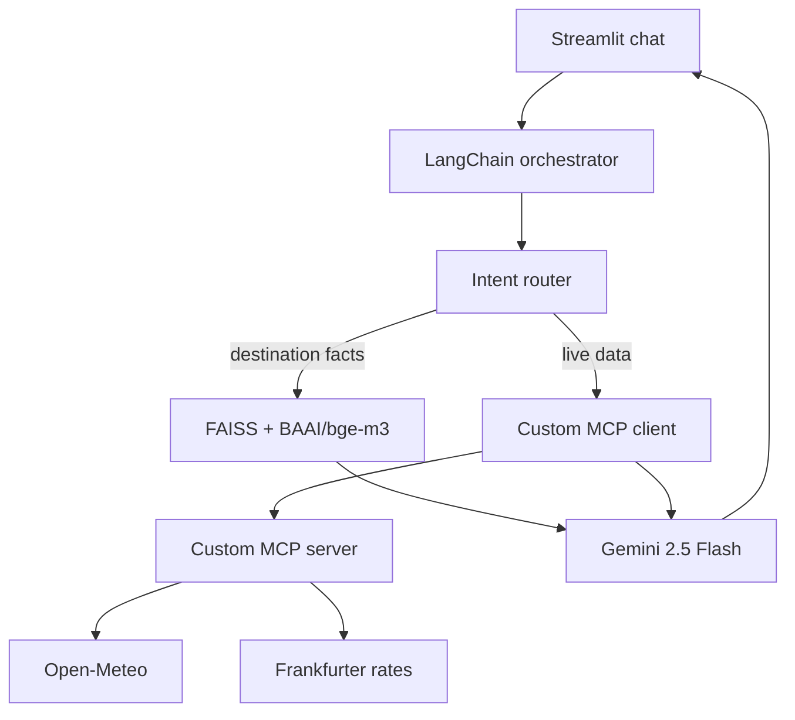

# AI Travel Planning Assistant — Singapore

> **Public repository:** `https://github.com/lakshaygoyat/ai-travel-planning-assistant`

A context-aware travel assistant that combines stable Singapore destination knowledge retrieved with RAG and current weather/currency information obtained through a **custom-built MCP server**.

## Architecture



The application uses deterministic routing for auditable tool selection, LangChain for prompts/retrieval/model orchestration, BAAI/bge-m3 for local embeddings, FAISS as the vector store, Gemini 2.5 Flash for generation, and the official Python MCP SDK for a locally implemented stdio server and client.

## Features

- Semantic RAG over four source-attributed Singapore documents.
- Grounded answers with source titles and links.
- Custom `get_singapore_weather` MCP tool backed by Open-Meteo.
- Custom `convert_currency` MCP tool backed by Frankfurter reference rates.
- Combined weather-aware itinerary generation.
- Streamlit multi-turn chat with retained session context.
- Visible execution trace distinguishing retrieval, MCP results and model recommendations.
- Explicit handling of incomplete requests and external-tool failure.
- Optional terminal interface.

## Project structure

```text
ai-travel-planning-assistant/
├── app.py                         # Streamlit chat UI
├── cli.py                         # Optional terminal UI
├── knowledge_base/                # Four curated, source-attributed documents
├── src/
│   ├── assistant.py               # Routing, RAG, prompt and response orchestration
│   ├── build_index.py             # Chunking, BGE-M3 embeddings and FAISS persistence
│   ├── config.py                  # Paths and environment configuration
│   ├── mcp_client.py              # Custom MCP stdio client
│   └── mcp_server.py              # Custom weather and currency MCP tools
├── tests/                         # Routing and helper unit tests
├── .env.example
├── requirements.txt
├── sample_questions.md
```

## Knowledge-base sources

The included Markdown files are concise original summaries rather than copied pages. Each retains title, URL and access date as metadata.

1. [Wikivoyage — Singapore](https://en.wikivoyage.org/wiki/Singapore)
2. [Visit Singapore — Getting Around](https://www.visitsingapore.com/travel-guide-tips/getting-around/)
3. [Visit Singapore — Food and Drink](https://www.visitsingapore.com/dining-drinks-singapore/)
4. [Visit Singapore — Itineraries](https://www.visitsingapore.com/singapore-itineraries/)

## Prerequisites

- Python 3.12 (recommended; 3.10+ supported)
- VS Code with the Microsoft Python extension
- A Gemini API key
- Internet access for the first embedding-model download, Gemini, weather and currency calls

## Get a Gemini API key

1. Open [Google AI Studio API Keys](https://aistudio.google.com/app/apikey) and sign in.
2. Accept the terms if prompted.
3. Select or create/import a Google Cloud project.
4. Choose **Create API key**. New keys may be authorization keys linked to a service account.
5. Copy the key once and keep it private. Do not paste it into source code or commit it.
6. If your organization prevents key creation, use a personal project or request the required project permissions from the administrator.

The model ID used by this project is `gemini-3.6-flash`.

## Run locally in VS Code — Windows PowerShell

Open the project folder in VS Code, then open **Terminal → New Terminal**:

```powershell
py -3.12 -m venv .venv
.\.venv\Scripts\Activate.ps1
python -m pip install --upgrade pip
pip install -r requirements.txt
Copy-Item .env.example .env
```

Open `.env` and replace the placeholder:

```dotenv
GEMINI_API_KEY=your_real_key_here
GEMINI_MODEL=gemini-3.6-flash
```

Build the vector index (the first run downloads BAAI/bge-m3 and can take several minutes):

```powershell
python -m src.build_index
```

Run tests and start the UI:

```powershell
pytest -q
streamlit run app.py
```

Open `http://localhost:8501` if it does not open automatically.

### PowerShell activation error

If script execution is blocked, run this only for the current terminal and activate again:

```powershell
Set-ExecutionPolicy -Scope Process -ExecutionPolicy Bypass
.\.venv\Scripts\Activate.ps1
```

## Run locally — macOS/Linux

```bash
python3.12 -m venv .venv
source .venv/bin/activate
python -m pip install --upgrade pip
pip install -r requirements.txt
cp .env.example .env
# Edit .env and add GEMINI_API_KEY
python -m src.build_index
pytest -q
streamlit run app.py
```

The Streamlit app starts the MCP server as a subprocess for each live-data request, so a second terminal is **not required**. To inspect the MCP server independently, run `python -m src.mcp_server` and use an MCP inspector/client over stdio.

Optional terminal UI:

```bash
python cli.py
```

## RAG workflow

1. Read Markdown documents and retain title/URL metadata.
2. Split on headings and paragraphs into 750-character chunks with 120-character overlap.
3. Create normalized embeddings using `BAAI/bge-m3`.
4. Store embeddings and metadata in FAISS.
5. Retrieve the top four semantically similar chunks for destination questions.
6. Give only retrieved chunks to Gemini as destination evidence.
7. Render source titles/URLs in the response trace and require `[KBn]` citations.

If relevant evidence is missing, the system prompt requires the model to state that the knowledge base is insufficient.

## MCP design

This repository does **not** use a ready-made MCP server. `src/mcp_server.py` implements two tools with FastMCP:

| Tool | Input | External service | Output |
|---|---|---|---|
| `get_singapore_weather` | `days` (1–7) | Open-Meteo | Dates, condition, min/max °C and rain probability |
| `convert_currency` | amount, source ISO code, target ISO code | Frankfurter | Converted amount, reference rate and rate date |

`src/mcp_client.py` launches the server using stdio, initializes an MCP session, discovers the available tools and calls the selected tool. The UI never calls the REST providers directly. Provider/network failures become structured `status: error` results and are not replaced with invented values.

## Prompt and context strategy

- Destination facts may come only from retrieved KB chunks.
- Current weather/rates may come only from MCP results.
- Evidence is treated as data, not instructions.
- Unsupported facts, opening hours and prices must not be invented.
- The model distinguishes factual evidence from its own planning recommendations.
- The latest six messages are included for follow-up context; Streamlit retains the full visible session.
- Temperature is low for consistent answers.

## Example demo sequence

1. **RAG:** `What are the must-visit attractions in Singapore?`
2. **Weather MCP:** `What is the forecast for the next three days?`
3. **Currency MCP:** `Convert 50000 INR to SGD.`
4. **Combined:** `Plan a three-day Singapore itinerary for next week and adjust it according to the weather forecast.`
5. **Context:** `Make day two family-friendly and keep the indoor backup.`

Expand **Evidence and execution trace** after each response. More cases are in [sample_questions.md](sample_questions.md); the short recording plan is in [DEMO_SCRIPT.md](DEMO_SCRIPT.md).

## Testing and failure handling

`pytest -q` checks tool routing, amount parsing, forecast-day parsing and weather-code mapping. For a manual failure test, disconnect the network and request weather: the response must say current information could not be verified. For missing-input handling, ask `Convert my budget to SGD`; the assistant requests the amount/source rather than guessing.

## Publish as a public GitHub repository

First edit the **Public repository** line at the top of this README with your GitHub username. Then run:

```bash
git init
git add .
git commit -m "feat: add AI travel planning assistant"
git branch -M main
gh auth login
gh repo create ai-travel-planning-assistant --public --source=. --remote=origin --push
```

If GitHub CLI is unavailable, create an empty public repository on github.com and run the `git remote add origin ...` and `git push -u origin main` commands shown by GitHub. Confirm `.env` is absent from `git status` before pushing.

## Acceptance checklist

- [x] At least three source-attributed travel resources
- [x] Meaningful chunking, BAAI/bge-m3 embeddings and FAISS retrieval
- [x] Grounded answers with source references
- [x] Custom MCP weather tool
- [x] Custom MCP currency tool
- [x] Auditable intent-based tool selection
- [x] Combined RAG + weather scenario
- [x] Multi-turn conversation context
- [x] Missing-input and MCP-failure handling
- [x] Streamlit UI and terminal alternative
- [x] Setup, architecture, prompt strategy, samples and demo documentation

## Security and limitations

- `.env` and generated vector data are excluded from Git.
- Exchange results use the provider's latest available reference rate, which may be the latest business day and is not a trading quote.
- Forecast accuracy decreases with distance into the future.
- Source summaries are small demonstration content; production systems should implement source licensing review, scheduled refresh, richer evaluation and observability.
